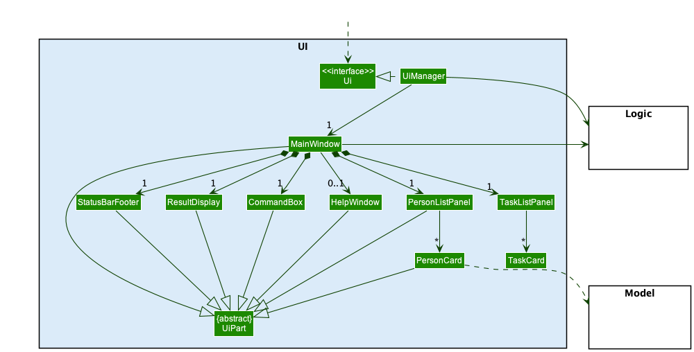
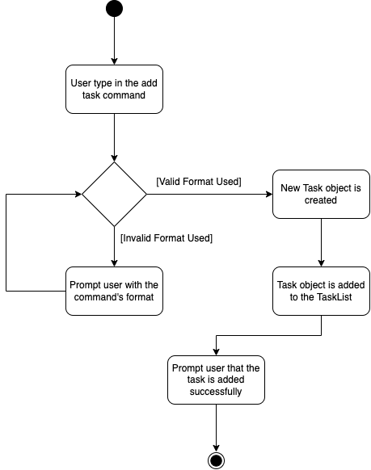
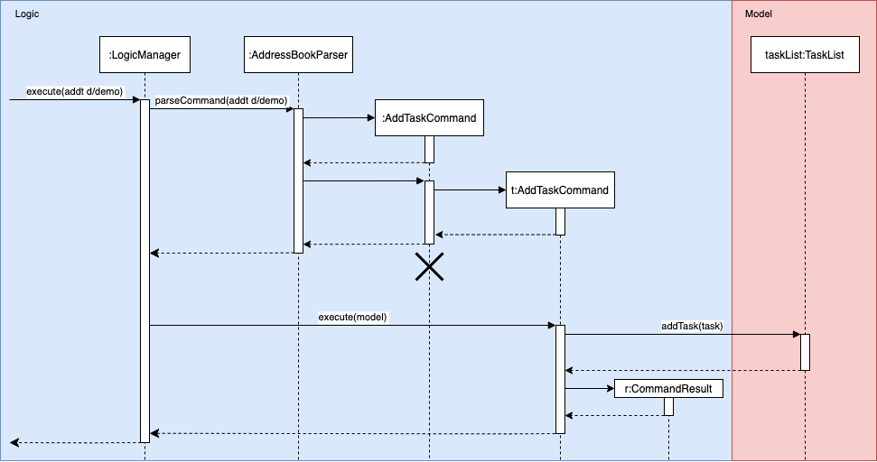
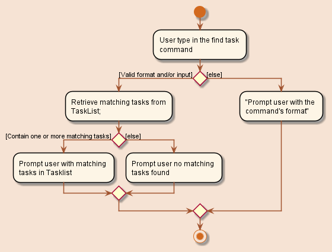
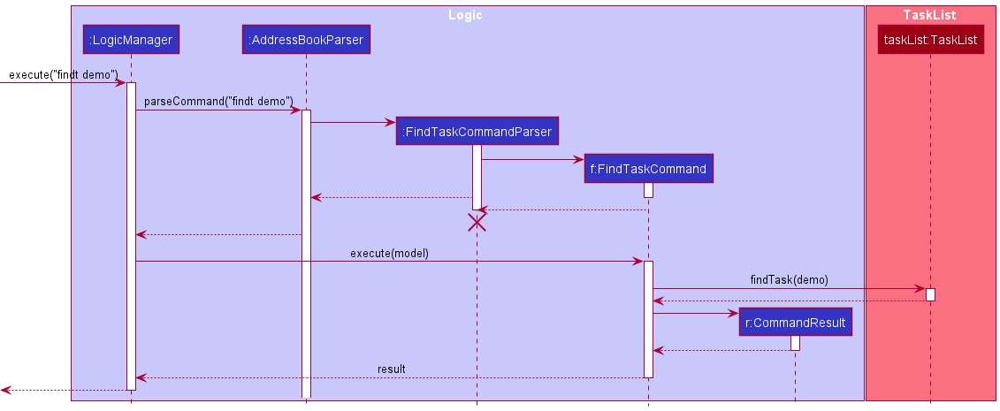
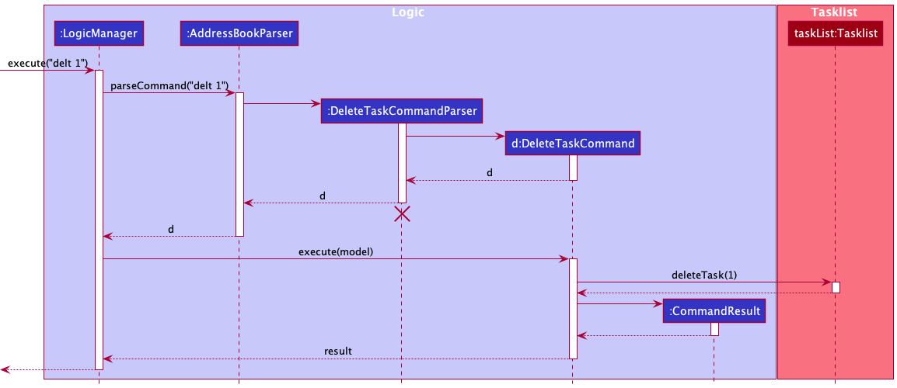
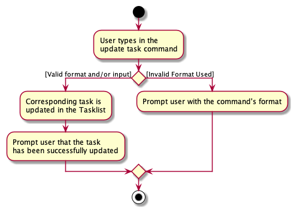
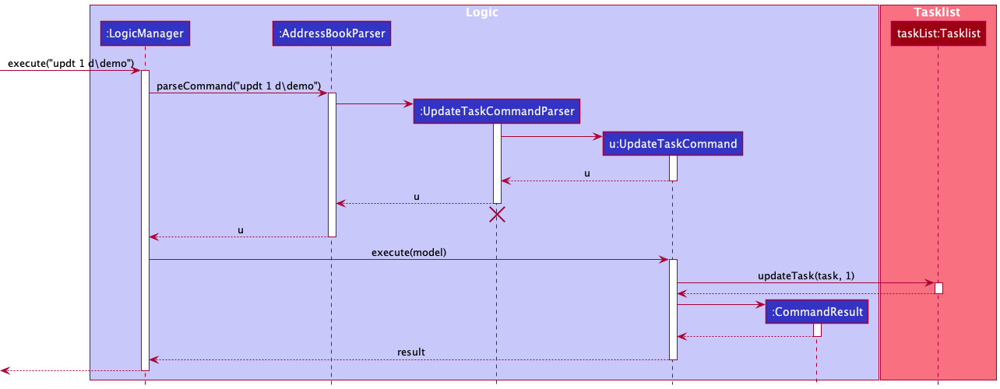

* Table of Contents
{:toc}

--------------------------------------------------------------------------------------------------------------------

## **Acknowledgements**
* This project is based on the [AddressBook-Level3 project](https://github.com/se-edu/addressbook-level3) created by the [SE-EDU initiative](https://se-education.org/).
* Libraries used: [JavaFX](https://openjfx.io/), [Jackson](https://github.com/FasterXML/jackson), [JUnit5](https://github.com/junit-team/junit5)
* The regex method to implement `FindTask` feature was referenced and adapted from [stackoverflow](https://stackoverflow.com/questions/25483114/regex-to-find-whole-word-in-text-but-case-insensitive).

--------------------------------------------------------------------------------------------------------------------

## **Setting up, getting started**

Refer to the guide [_Setting up and getting started_](SettingUp.md).

--------------------------------------------------------------------------------------------------------------------

## **Design**

:bulb: **Tip:** The `.puml` files used to create diagrams in this document can be found in the [diagrams](https://github.com/se-edu/addressbook-level3/tree/master/docs/diagrams/) folder. Refer to the [_PlantUML Tutorial_ at se-edu/guides](https://se-education.org/guides/tutorials/plantUml.html) to learn how to create and edit diagrams.

### Architecture

The ***Architecture Diagram*** given above explains the high-level design of the App.

Given below is a quick overview of main components and how they interact with each other.

**Main components of the architecture**

**`Main`** has two classes called [`Main`](https://github.com/se-edu/addressbook-level3/tree/master/src/main/java/seedu/address/Main.java) and [`MainApp`](https://github.com/se-edu/addressbook-level3/tree/master/src/main/java/seedu/address/MainApp.java). It is responsible for,
* At app launch: Initializes the components in the correct sequence, and connects them up with each other.
* At shut down: Shuts down the components and invokes cleanup methods where necessary.

[**`Commons`**](#common-classes) represents a collection of classes used by multiple other components.

The rest of the App consists of four components.

* [**`UI`**](#ui-component): The UI of the App.
* [**`Logic`**](#logic-component): The command executor.
* [**`Model`**](#model-component): Holds the data of the App in memory.
* [**`Storage`**](#storage-component): Reads data from, and writes data to, the hard disk.

**How the architecture components interact with each other**

The *Sequence Diagram* below shows how the components interact with each other for the scenario where the user issues the command `delete 1`.

Each of the four main components (also shown in the diagram above),

* defines its *API* in an `interface` with the same name as the Component.
* implements its functionality using a concrete `{Component Name}Manager` class which follows the corresponding API `interface` mentioned in the previous point.

For example, the `Logic` component defines its API in the `Logic.java` interface and implements its functionality using the `LogicManager.java` class which follows the `Logic` interface. Other components interact with a given component through its interface rather than the concrete class (reason: to prevent outside component's being coupled to the implementation of a component), as illustrated in the (partial) class diagram below.

The sections below give more details of each component.

### UI component

The **API** of this component is specified in [`Ui.java`](https://github.com/se-edu/addressbook-level3/tree/master/src/main/java/seedu/address/ui/Ui.java)

The UI consists of a `MainWindow` that is made up of parts e.g.`CommandBox`, `ResultDisplay`, `PersonListPanel`, `StatusBarFooter` , `TaskListPanel` etc. All these, including the `MainWindow`, inherit from the abstract `UiPart` class which captures the commonalities between classes that represent parts of the visible GUI.

The `UI` component uses the JavaFx UI framework. The layout of these UI parts are defined in matching `.fxml` files that are in the `src/main/resources/view` folder. For example, the layout of the [`MainWindow`](https://github.com/se-edu/addressbook-level3/tree/master/src/main/java/seedu/address/ui/MainWindow.java) is specified in [`MainWindow.fxml`](https://github.com/se-edu/addressbook-level3/tree/master/src/main/resources/view/MainWindow.fxml)

The `UI` component,

* executes user commands using the `Logic` component.
* listens for changes to `Model` data so that the UI can be updated with the modified data.
* keeps a reference to the `Logic` component, because the `UI` relies on the `Logic` to execute commands.
* depends on some classes in the `Model` component, as it displays `Person` and `Task` objects residing in the `Model`.

### Logic component

**API** : [`Logic.java`](https://github.com/se-edu/addressbook-level3/tree/master/src/main/java/seedu/address/logic/Logic.java)

Here's a (partial) class diagram of the `Logic` component:

How the `Logic` component works:
1. When `Logic` is called upon to execute a command, it uses the `AddressBookParser` class to parse the user command.
1. This results in a `Command` object (more precisely, an object of one of its subclasses e.g., `AddCommand`) which is executed by the `LogicManager`.
1. The command can communicate with the `Model` when it is executed (e.g. to add a person).
1. The result of the command execution is encapsulated as a `CommandResult` object which is returned from `Logic`.

The Sequence Diagram below illustrates the interactions within the `Logic` component for the `execute("delete 1")` API call.

:information_source: **Note:** The lifeline for `DeleteCommandParser` should end at the destroy marker (X) but due to a limitation of PlantUML, the lifeline reaches the end of diagram.

Here are the other classes in `Logic` (omitted from the class diagram above) that are used for parsing a user command:

How the parsing works:
* When called upon to parse a user command, the `AddressBookParser` class creates an `XYZCommandParser` (`XYZ` is a placeholder for the specific command name e.g., `AddCommandParser`) which uses the other classes shown above to parse the user command and create a `XYZCommand` object (e.g., `AddCommand`) which the `AddressBookParser` returns back as a `Command` object.
* All `XYZCommandParser` classes (e.g., `AddCommandParser`, `DeleteCommandParser`, ...) inherit from the `Parser` interface so that they can be treated similarly where possible e.g, during testing.

### Model component
**API** : [`Model.java`](https://github.com/se-edu/addressbook-level3/tree/master/src/main/java/seedu/address/model/Model.java)

The `Model` component,

* stores the address book data i.e., all `Person` objects (which are contained in a `UniquePersonList` object).
* stores the currently 'selected' `Person` objects (e.g., results of a search query) as a separate _filtered_ list which is exposed to outsiders as an unmodifiable `ObservableList<Person>` that can be 'observed' e.g. the UI can be bound to this list so that the UI automatically updates when the data in the list change.
* stores a `UserPref` object that represents the user’s preferences. This is exposed to the outside as a `ReadOnlyUserPref` objects.
* does not depend on any of the other three components (as the `Model` represents data entities of the domain, they should make sense on their own without depending on other components)

:information_source: **Note:** An alternative (arguably, a more OOP) model is given below. It has a `Tag` list in the `AddressBook`, which `Person` references. This allows `AddressBook` to only require one `Tag` object per unique tag, instead of each `Person` needing their own `Tag` objects. 

### Storage component

**API** : [`Storage.java`](https://github.com/se-edu/addressbook-level3/tree/master/src/main/java/seedu/address/storage/Storage.java)

The `Storage` component,
* can save both address book data and user preference data in json format, and read them back into corresponding objects.
* inherits from both `AddressBookStorage` and `UserPrefStorage`, which means it can be treated as either one (if only the functionality of only one is needed).
* depends on some classes in the `Model` component (because the `Storage` component's job is to save/retrieve objects that belong to the `Model`)

### Common classes

Classes used by multiple components are in the `seedu.addressbook.commons` package.

--------------------------------------------------------------------------------------------------------------------

## **Implementation**

This section describes some noteworthy details on how certain features are implemented.

### \[Proposed\] Task Storage Feature (Yu An)

The proposed task storage feature is facilitated by `TaskListStorage` that follows original AB3's `AddressBookStorage` implementation closely.
Everytime when the user successfully executes a task command that either adds, deletes or updates a task, the data will be
written into `tasklist.json` and be saved to a `data` folder. The `tasklist.json` will also get updated when the user
executes `exit` command.

Below is an activity diagram to aid the understanding when data reading from and writing to the `tasklist.json` will happen:

### \[Proposed\] Add Task Feature (Yu An)
#### Proposed Implementation
The proposed add task feature is facilitated by `AddTaskCommand`. It extends `Command` and makes use of a new model `TaskList` and `Task`.
The `TaskList` model consists of an `ArrayList<Task>` to store the `Task`. The `AddTaskCommand` also has a `AddTaskCommandParser`
to do the logical parsing of the user's input. Additionally, this feature implements the following operations:

* `AddTaskCommand#execute()` — Executes the command.
* `AddTaskCommandParser#parse()` — Make sense of the user's input and returns an `AddTaskCommand` object.
* `TaskList#addTask()` — Add a new task to the task list if user's input is valid.

The `TaskList#addTask()` is exposed in the `Model` interface as `Model#addTask()`.

Given below is an example usage scenario and how the add task feature works.

The following activity diagram shows the workflow of the add task operation:

The user will type in the command `addt d/DESCRIPTION [t/DEADLINE (dd/mm/yyyy)]` with the deadline being an optional field.
If a valid format is detected, the system will create a new task, add it to the task list and prompt the user that a
task has been successfully added.

The following sequence diagram shows how the add task operation works assuming no exception is thrown:

### \[Proposed\] Find Task Feature (Yu Meng)
#### Proposed Implementation
The proposed find task feature is facilitated by `FindTaskCommand`. It extends `Command` and makes use of the `TaskList` model
and `Task`. The `TaskList` Model is used to retrieve the `Tasks` that have been stored. The `FindTaskCommand` also has a
`FindTaskCommandParser` to do the logical parsing of the user's input. It uses regex to ignore case sensitivity of user's input.
These are the operations that the feature implements:
* `FindTaskCommand#execute()` : Executes the command.
* `FindTaskCommandParser#parse()` :  Parses the user input and returns a `FindTaskCommand` Object.
* `TaskList#findTask()` : Finds and returns tasks matching keyword from user input (ignores case sensitivity)

Given below is an example usage scenario and how the find task feature works.

The following activity diagram shows the workflow of add task operation:

The user will type in the command `findt KEYWORD`. If the user inputs a valid format, the system will retrieve matching
tasks from the TaskList. If there is one or more matching Tasks, the system will prompt the user with the matching Tasks.

The following sequence diagram shows how the add task operation work assuming no exception is thrown:

### \[Proposed\] Add Delete Task Feature (Ivor)
#### Proposed Implementation
The proposed delete task feature is facilitated by `DeleteTaskCommand`. It extends `Command` and makes use of a new model `TaskList` and `Task`.
The `TaskList` model consists of an `ArrayList<Task>` to store the `Task`. The `DeleteTaskCommand` also has a `DeleteTaskCommandParser`
to do the logical parsing of the user's input. Additionally, this feature implements the following operations:

* `DeleteTaskCommand#execute()` — Executes the command.
* `DeleteTaskCommandParser#parse()` — Make sense of the user's input and returns an `DeleteTaskCommand` object.
* `TaskList#deleteTask()` — Delete an existing task in the task list if user's input is valid.

The `TaskList#deleteTask()` is exposed in the `Model` interface as `Model#deleteTask()`.

Given below is an example usage scenario and how the delete task feature works.

The following activity diagram shows the workflow of the delete task operation:

The user will type in the command `delt <integer>`.
If a valid format is detected, the system will remove the corresponding task with the integer ID, and prompt the user that a
task has been successfully deleted.

The following sequence diagram shows how the delete task operation works assuming no exception is thrown:

### \[Proposed\] Add Update Task Feature (Ivor)
#### Proposed Implementation
The proposed update task feature is facilitated by `UpdateTaskCommand`. It extends `Command` and make use of a new model `TaskList` and `Task`.
The `TaskList` model consists of an `ArrayList<Task>` to store the `Task`. The `UpdateTaskCommand` also has a `UpdateTaskCommandParser`
to do the logical parsing of user's input. Additionally, this feature implements the following operations:

* `UpdateTaskCommand#execute()` — Executes the command.
* `UpdateTaskCommandParser#parse()` — Make sense of the user's input and returns an `UpdateTaskCommand` object.
* `TaskList#updateTask()` — Updates an existing task in the task list if user's input is valid.

The `TaskList#updateTask()` is exposed in the `Model` interface as `Model#updateTask()`.

Given below is an example usage scenario and how the update task feature works.

The following activity diagram shows the workflow of the delete task operation:

The user will type in the command `updt <integer> d\new description t\ new deadline`. Either parameter is optional but at least one must be provided.
If a valid format is detected, the system will update the corresponding task with the integer ID with the new attributes, and prompt the user that a
task has been successfully updated.

The following sequence diagram shows how the update task operation works assuming no exception is thrown:

--------------------------------------------------------------------------------------------------------------------

## **Documentation, logging, testing, configuration, dev-ops**

* [Documentation guide](Documentation.md)
* [Testing guide](Testing.md)
* [Logging guide](Logging.md)
* [Configuration guide](Configuration.md)
* [DevOps guide](DevOps.md)

--------------------------------------------------------------------------------------------------------------------

## **Appendix: Requirements**

### Product scope

**Target user profile**:

NUScheduler is for Year 1 NUS Computing students who prefer CLI to GUI and have a lot of academic tasks to keep track of.

**Value proposition**: This app has simple CLI and a sleek GUI that allows the user to manage tasks easily and efficiently. It will mainly be used to keep track of NUS assignments and projects across multiple modules.

### User stories

Priorities: High (must have) - `* * *`, Medium (nice to have) - `* *`, Low (unlikely to have) - `*`

| Priority | As a …​                  | I want to …​                         | So that I can…​                      |
|----------|--------------------------|--------------------------------------|--------------------------------------|
| `* * *`  | beginner user            | add a task                           | keep track of the task               |
| `* * *`  | beginner user            | delete a task                        | remove a task I have completed       |
| `* * *`  | beginner user            | edit a task                          | change details of a task             |
| `* * *`  | beginner user            | view all tasks                       | keep track of all my current tasks   |
| `* * *`  | beginner user            | add a contact                        | keep track of all my contacts        |
| `* * *`  | beginner user            | delete a contact                     | delete an incorrect/unneeded contact |
| `* * *`  | beginner user            | delete a task                        | delete an incorrect/unneeded task    |
| `* * *`  | beginner user            | edit a contact                       | correct/update a contact             |
| `* * *`  | beginner user            | update a task                        | correct/update a task                |
| `* * *`  | beginner user            | find tasks based on keyword          | search for relevant tasks quickly    |
| `* * *`  | beginner user            | find contacts based on keyword       | search for relevant contacts quickly |
| `* * *`  | beginner user            | view all contacts                    | view all my current contacts         |
| `* * *`  | beginner user            | add a label                          | know which task is for which module  |
| `* * *`  | potential user           | use simple commands                  | learn the commands easily            |
| `* * *`  | year 1 computing student | keep track of assignment deadlines   | complete the tasks on time           |
| `*`      | beginner user            | see a reminder of tasks from the app | know what are my upcoming deadlines  |

### Use cases

(For all use cases below, the **System** is the `NUScheduler` and the **Actor** is the `user`, unless specified otherwise)

**Use case: Delete a contact**

**MSS**

1.  User requests to list contacts
2.  NUScheduler shows a list of contacts
3.  User requests to delete a specific contact in the list
4.  NUScheduler deletes the contact

    Use case ends.

**Extensions**

* 2a. The list is empty.

  Use case ends.

* 3a. The given index is invalid.

    * 3a1. NUScheduler shows an error message.

      Use case resumes at step 2.

**Use case: Add a task**

**MSS**

1. User add a task with add task command
2. NUScheduler provide feedback based on the user input.
3. NUScheduler adds the user's defined task to the task list

   Use case ends.

**Extensions**

* 2a. The task description is empty.
    * 2a1. NUScheduler prompts the user to fill up the description.

      Use case ends.

* 2b. The task deadline has a wrong date format.
    * 2b1. NUScheduler shows an error message.

    Use case ends.

* 2c. The task has multiple description prefix (`d/`) or deadline prefix (`t/`).
    * 2c1. NUScheduler prompts the user to fill up the description.

      Use case ends.

* 2d. The task has deadline prefix (`t/`) in the task description.
    * 2d1. NUScheduler prompts the user to fill up the description.

      Use case ends.

* 2e. The task deadline is before today's date.
    * 2e1. NUScheduler prompts the user to fill up the description.

      Use case ends.

* 2f. The task deadline is invalid (e.g. 30/02/2022).
    * 2f1. NUScheduler prompts the user to fill up the description.

      Use case ends.

**Use case: Delete a task**

**MSS**

1. User requests to delete a task with delete task command
2. NUScheduler deletes task specified from task list

   Use case ends.

**Extensions**

* 2a. The task list is empty.
    * 2a1. NUScheduler shows an error message.

      Use case ends.

* 2b. The task number to delete is invalid.
    * 2b1. NUScheduler shows an error message.

      Use case ends.

**Use case: View all tasks**

**MSS**

1. User requests to view all the tasks with view command
2. NUScheduler shows all the tasks from task list

   Use case ends.

**Extensions**

* 2a. The task list is empty.
    * 2a1. NUScheduler shows a message that the task list is empty.

      Use case ends.

**Use case: Find tasks**

**MSS**

1. User requests to find tasks with find command
2. NUScheduler provides a list of matching tasks from the task list.

   Use case ends.

**Extensions**

* 2a. The task list is empty.
    * 2a1. NUScheduler shows a message that the task list is empty.

      Use case ends.

* 2b. No task matches.
    * 2b1. NUScheduler shows a message that there are no tasks that matches the description.

      Use case ends.

* 2c. Tasks found.
    * 2c1. NUScheduler shows all the tasks that matches with the keyword.

      Use case ends.

**Use case: Update a task**

**MSS**

1. User requests to update a task with update task command
2. NUScheduler updates task specified from task list

   Use case ends.

**Extensions**

* 2a. The task list is empty.
    * 2a1. NUScheduler shows an error message.

      Use case ends.

* 2b. The task number to update is invalid.
    * 2b1. NUScheduler shows an error message.

      Use case ends.

* 2c. No prefix is provided.
    * 2c1. NUScheduler prompts the user use the correct command format.

      Use case ends.

* 2d. The task deadline has a wrong time format.
    * 2d1. NUScheduler shows an error message.

      Use case ends.

* 2e. The task has multiple description prefix (`d/`) or deadline prefix (`t/`).
    * 2e1. NUScheduler shows an error message.

      Use case ends.

--------------------------------------------------------------------------------------------------------------------

### Non-Functional Requirements

1. Should work on any _mainstream OS_ as long as it has Java `11` is installed.
2. Should be used by a single user.
3. Should be able to hold up to 1000 persons without a noticeable sluggishness in performance for typical usage.
4. A user with above average typing speed for regular English text (i.e. not code, not system admin commands) should be able to accomplish most of the tasks faster using commands than using the mouse.
5. The command used should be simple to learn.
6. New user should be able to access the help page within 3 actions upon launching the application.
7. The system should be usable by a novice who has never used the system before.
8. The system should be backward compatible with data produced by earlier versions of the system.
9. Each command should not take more than 5 second to complete.
10. Each command should display the result.
11. The order of the user input parameters when executing a command should not matter.
12. Texts in the UI should wrap around.
13. The project is expected to adhere to a schedule that delivers a feature set every milestone.
14. Data should be stored locally.
15. Data should be stored in a human-editable format.
16. Data should be able to port over to another computer.
17. Should notify the user with necessary information if their input does not follow the format.
18. Should be portable without using any installer.
19. Should be packaged into a single file, in JAR format.
20. Should have a total app size of at most 100 MB.
21. Should function without a remote server.
22. Should not allow duplicate entries of person with the same name.
23. Should allow duplicated tasks with same description.

--------------------------------------------------------------------------------------------------------------------

### Glossary

* **Mainstream OS**: Windows, Linux, Unix, OS-X
* **Private contact detail**: A contact detail that is not meant to be shared with others
* **Task**: A task with descriptions and/or deadline
* **Task list**: A task list of all the tasks
* **Task list ID**: ID assigned to corresponding task in the list
* **Prefix**: A header (eg `d/`, `t/`) that is used to identify different clauses in user inputs.
* **Data**: It refers to the entries of person in `addressbook.json` or task in `tasklist.json`.

--------------------------------------------------------------------------------------------------------------------

## **Appendix: Instructions for manual testing**

Given below are instructions to test the app manually.

:information_source: **Note:** These instructions only provide a starting point for testers to work on;
testers are expected to do more *exploratory* testing.

### Launch and shutdown

1. Initial launch

    1a. Download the jar file and copy into an empty folder

    1b. Double-click the jar file Expected: Shows the GUI with a set of sample contacts. The window size may not be optimum.

    1c. If double-click does not work, user can run `java -jar NUScheduler.jar` in terminal in the same directory as the jar file.

2. Saving window preferences

    2a. Resize the window to an optimum size. Move the window to a different location. Close the window.

    2b. Re-launch the app by double-clicking the jar file. 
       Expected: The most recent window size and location is retained.

### Deleting a person

1. Deleting a person while all persons are being shown

   1. Prerequisites: List all persons using the `list` command. Multiple persons in the list.

   1. Test case: `delete 1` 
      Expected: First contact is deleted from the list. Details of the deleted contact shown in the status message. Timestamp in the status bar is updated.

   1. Test case: `delete 0` 
      Expected: No person is deleted. Error details shown in the status message. Status bar remains the same.

   1. Other incorrect delete commands to try: `delete`, `delete x`, `...` (where x is larger than the list size) 
      Expected: Similar to previous.

### Saving data in JSON

1. The system automatically loads up a preset JSON file if there is any missing json files.
2. The system will automatically save data in JSON format when the user successfully executes command.
3. The system will automatically save data in JSON format when the user exits the application.

--------------------------------------------------------------------------------------------------------------------
