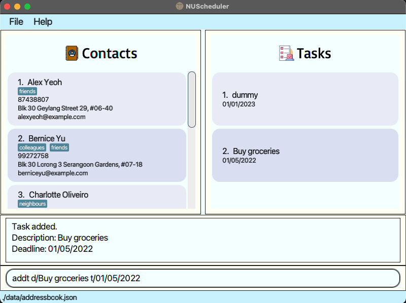
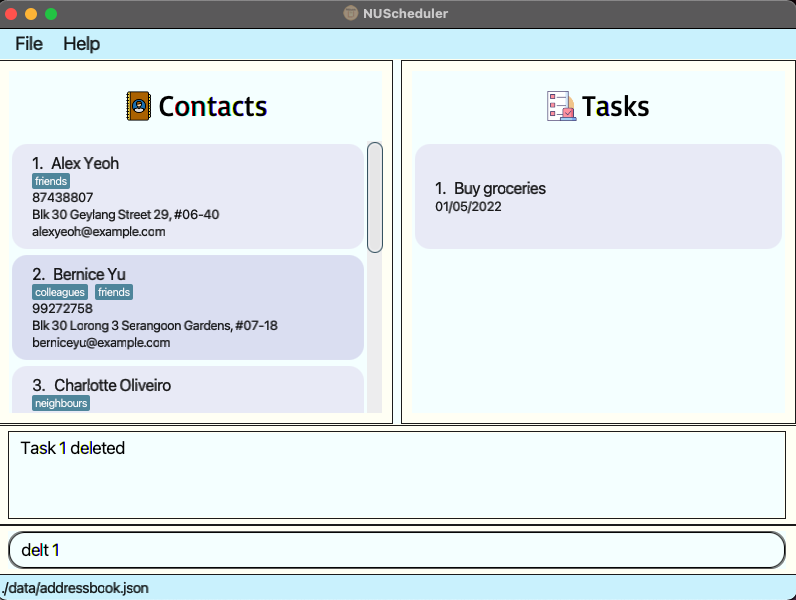
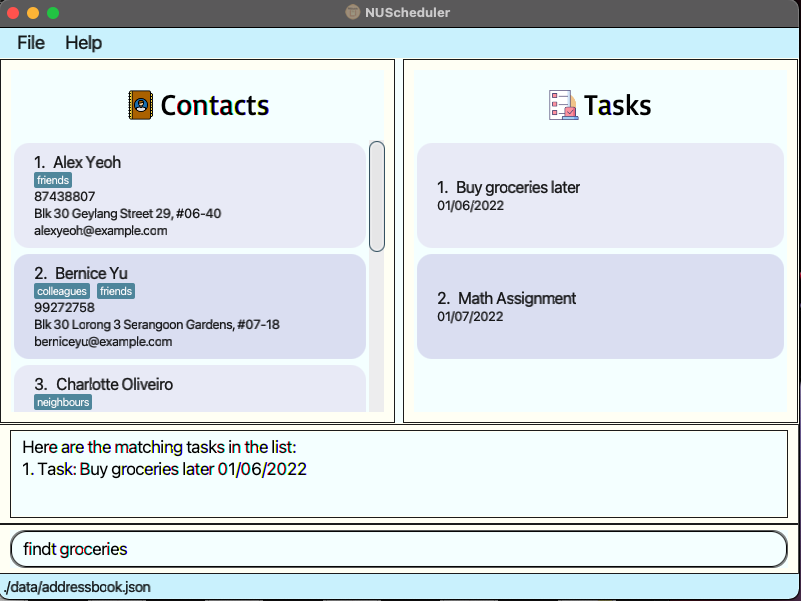
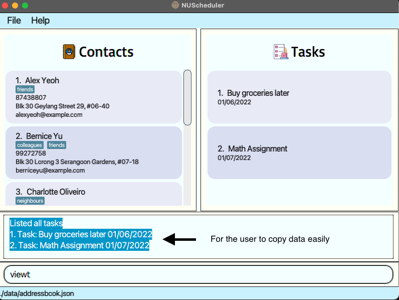
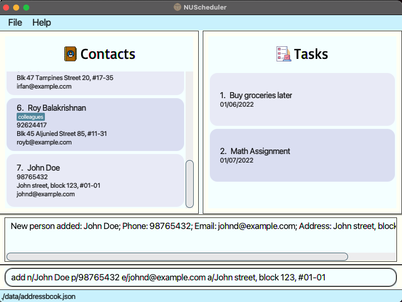
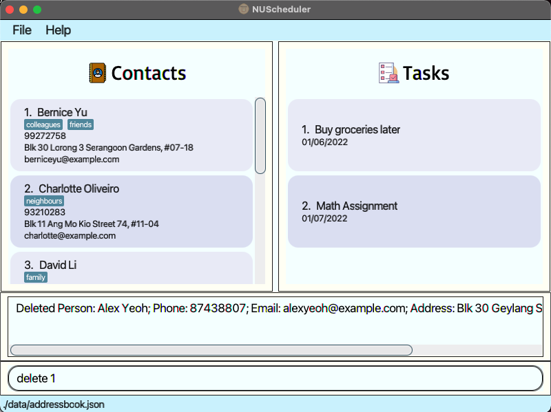
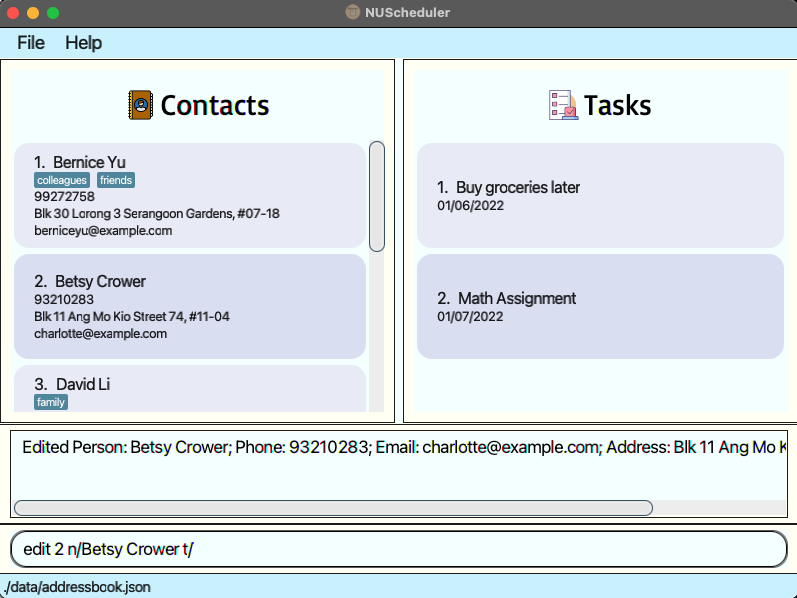
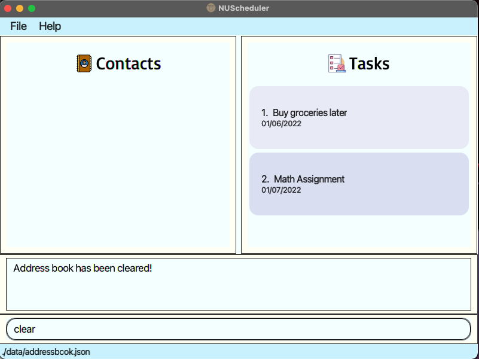
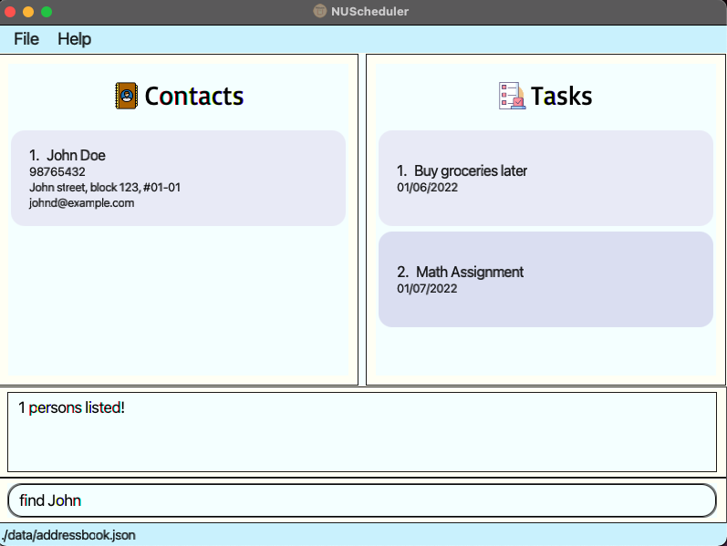

#NUScheduler
NUScheduler is a desktop app for Year 1 Computing students to assist with more efficient management of tasks and contacts,
optimized for use via a Command Line Interface (CLI) while still having the benefits of a Graphical User Interface (GUI).
If you can type fast, NUScheduler can schedule your tasks faster than traditional GUI apps.

- [Quick Start](#quick-start)
- [Features](#features)
    - [Task Management](#task-management)
        - [Add task](#feature-1)
        - [Delete task](#feature-2)
        - [Update task](#feature-3)
        - [Find task](#feature-4)
        - [View all tasks and their deadlines](#feature-5)
    - [Contact Management](#contact-management)
        - [Add contact](#feature-6)
        - [Delete contact](#feature-7)
        - [Edit contact](#feature-8)
        - [List all contacts](#feature-9)
        - [Clear all contacts](#feature-10)
        - [Find all contacts](#feature-11)
    - [Exit the app](#feature-12)
- [FAQ](#faq)
- [Command Summary](#command-summary)

--------------------------------------------------------------------------------------------------------------------

## Quick start

1. Ensure you have `Java 11` installed in your Computer.

2. Download the latest `NUScheduler.jar` from [here](https://github.com/AY2122S2-CS2103-F11-4/tp/releases/tag/v1.3).

3. Copy the file to the folder you want to use as the _home folder_ for your NUScheduler.

4. Double-click the file to start the app. The GUI similar to the below should appear in a few seconds. Note how the app contains some sample data. 
   

6. Type the command in the command box and press Enter to execute it. e.g. typing **`help`** and pressing Enter will open the help window. 
   Some example commands you can try:
   1. `add n/Beow Tan p/91234157 e/beow@example.com a/Jurong street 11, block 123, #01-01` : Adds a contact named Beow Tan to NUScheduler.
   2. `addt d/CS2105 Assignment 1 t/01/03/2022` : Adds a task to NUScheduler.
   3. `findt swimming lesson` : Finds any tasks in the current task list that contains the keyword(s).
   4. `updt 1 d/CS2102 Assignment 1` : Updates the specified task in the current list.
   5. `viewt` : Lists all tasks.
   6. `list` : Lists all contacts.
   7. `delete 1` : Deletes the 1st contact shown in the current list.
   8. `delt 1` : Deletes the 1st task shown in the current task list.
   9. `clear` : Deletes all contacts.
   10. `exit` : Exits the app.

7. Refer to the [Features](#features) below for details of each command.

--------------------------------------------------------------------------------------------------------------------

## Features

**:information_source: Notes about the command format:** 

**Notes about the command format:**

- Words in **UPPER_CASE** are the parameters to be supplied by the user.e.g. in `add n/NAME`, **NAME** is a parameter.
- which can be used as `add n/John Doe`.
- Items in **square brackets** are optional.e.g `n/NAME [t/TAG]` can be used as `n/John Doe t/friend` or as `n/John Doe`.
- Parameters can be in any order given in the command format.e.g. if the command format. specifies 
`addt d/DESCRIPTION [t/DEADLINE]`, the details can be entered as `[t/DEADLINE] d/DESCRIPTION`.
- All `<Integer>` fields must be greater than 0.
- Additional parameters for commands that do not take in any parameters (such as `list`) will be ignored.
  e.g. if you input `list aa`, NUScheduler will understand it as `list`.

## Task Management

--------------------------------------------------------------------------------------------------------------------

### Feature 1
#### Add Task - Adds a task: `addt`

Adds a task to the task list. There will be no restriction on duplicate tasks. The deadline must follow the date format
specified and the deadline cannot be earlier than today's date or invalid date (e.g.31/02/2022).

Format: `addt d/DESCRIPTION [t/DEADLINE (dd/mm/yyyy)]`

Example: `addt d/Buy groceries t/01/01/2022`

### Feature 2
#### Feature - Deletes a task: `delt`

Deletes a task from the task list, where `<Integer>` is the ID of the task.

Format: `delt <Integer>`

Example: `delt 1`

### Feature 3
#### Feature - Updates a task description and/or deadline: `updt`

Updates a task in the task list, where `<Integer>` is the ID of the task. At least one parameter must be provided.

Format 1: `updt <Integer> t/DEADLINE`

Format 2: `updt <Integer> d/DESCRIPTION`

Format 3: `updt <Integer> d/DESCRIPTION t/DEADLINE`

Example 1: `updt 3 t/01/02/2022`

Example 2: `updt 3 d/Buy groceries`

Example 3: `updt 3 d/Buy groceries later t/01/06/2022`

### Feature 4
#### Feature - Find tasks: `findt`

Locating tasks which match any of given keyword(s).

Format: `findt KEYWORD [MORE_KEYWORDS]`

- The search is case-insensitive. e.g. `lessons` will match `Lessons`.
- The order of the keywords matters. e.g. `drink water` will not match `water drink`
- Only full keyword(s) will be accepted. e.g. `drink` will match `drink`; `ink` will not match `drink`
- All keyword(s) have to be matched for task to be returned.
- If a word is contained within a parentheses without spaces, the keyword has to contain the parentheses as well. 
e.g. `Assignment` will not match `(Assignment`.
- Allows the user to easily copy data from command box. Future versions of this program will update the UI according
to the search parameters.

Example: `findt lessons` returns `Swimming lessons 03/05/2022`. 

### Feature 5
#### Feature - List all tasks: `viewt`

View all the tasks currently in the task list. Allows the user to copy the data easily. Future versions of this program
will update the UI to display all tasks.

Format: `viewt`

## Contact Management

--------------------------------------------------------------------------------------------------------------------

### Feature 6
#### Feature - Adds a contact: `add`

Adds a contact to NUScheduler.

Format: `add n/NAME p/PHONE_NUMBER e/EMAIL a/ADDRESS [t/TAG]…​`

:bulb: **Tip:**
A contact can have any number of tags (including 0).

Examples:
* `add n/John Doe p/98765432 e/johnd@example.com a/John street, block 123, #01-01`
* `add n/Betsy Crowe t/friend e/betsycrowe@example.com a/Newgate Prison p/1234567 t/criminal`

### Feature 7
#### Feature - Deletes a contact : `delete`

Deletes the specified contact from NUScheduler.

Format: `delete <Integer>`

* Deletes the contact at the specified `<Integer>`.
* The integer refers to the index number shown in the displayed contact list.
* The integer **must be a positive integer**.

Examples:
* `list` followed by `delete 2` deletes the 2nd contact in NUScheduler.
* `find Betsy` followed by `delete 1` deletes the 1st contact in the results of the `find` command.

### Feature 8
#### Feature - Edits a contact : `edit`

Edits an existing contact in the NUScheduler.

Format: `edit <Integer> [n/NAME] [p/PHONE] [e/EMAIL] [a/ADDRESS] [t/TAG]…​`

* Edits the contact at the specified `INTEGER`. The integer refers to the index number shown in the displayed contact list. The integer **must be a positive integer**.
* At least one of the optional fields must be provided.
  * Existing values will be updated to the input values.
* When editing tags, the existing tags of the contact will be removed i.e adding of tags is not cumulative.
* You can remove all the contact’s tags by typing `t/` without
  specifying any tags after it. Note: For this clearing, only this format will be accepted. `edit <Integer> t/`

Examples:
*  `edit 1 p/91234567 e/johndoe@example.com` Edits the phone number and email address of the 1st contact to be `91234567` and `johndoe@example.com` respectively.
*  `edit 2 n/Betsy Crower t/` Edits the name of the 2nd contact to be `Betsy Crower` and clears all existing tags.

### Feature 9
#### Feature - List all contacts : `list`

Shows a list of all contacts in NUScheduler.

Format: `list`

### Feature 10
#### Feature - Clears all contact entries : `clear`

Clears all contacts from NUScheduler.

Format: `clear`

### Feature 11
#### Feature - Finds contacts containing any of the given keywords: `find`

Format: `find KEYWORD [MORE_KEYWORDS]`

* The search is case-insensitive. e.g `hans` will match `Hans`
* The order of the keywords does not matter. e.g. `Hans Bo` will match `Bo Hans`
* Only the name is searched.
* Only full words will be matched e.g. `Han` will not match `Hans`
* Contacts matching at least one keyword will be returned (i.e. `OR` search).
  e.g. `Hans Bo` will return `Hans Gruber`, `Bo Yang`

Examples:
* `find John` returns `john` and `John Doe`
* `find alex david` returns `Alex Yeoh`, `David Li` 

### Feature 12
#### Feature - Exit the app: `exit`

Exits the app.

Format: `exit`

NUScheduler data is saved in the hard disk automatically after any command that changes the data. There is no need to save manually.

### Note - Editing the data file

NUScheduler data are saved as a JSON file `[JAR file location]/data/addressbook.json` for contact list and `[JAR file location]/data/tasklist.json` for task list. 
Advanced users are welcome to update data directly by editing that data file.

:exclamation: **Caution:**
If your changes to the data file makes its format invalid, NUScheduler will discard all data and start with an empty data file at the next run.

--------------------------------------------------------------------------------------------------------------------

## FAQ

**Q**: How do I transfer my data to another Computer?

**A**: Install the app in the other computer and overwrite the empty data file it creates with the file that contains the
data of your previous NUScheduler home folder.

--------------------------------------------------------------------------------------------------------------------

## Command summary

| Action     | Format, Examples                                                                                                                                                      |
|------------|-----------------------------------------------------------------------------------------------------------------------------------------------------------------------|
| **addt**   | `addt d/DESCRIPTION [t/DEADLINE]`   e.g., `addt d/Buy groceries [t/2022 02 22 5pm]`                                                                                |
| **delt**   | `delt <Integer>`   e.g., `delt 3`                                                                                                                                  |
| **updt**   | `updt <Integer> [d/DESCRIPTION] [t/DEADLINE]`  e.g., `updt 3 d/Buy groceries t/01/01/2022`                                                                         |
| **findt**  | `findt KEYWORD [MORE_KEYWORDS]`   e.g., `findt swimming lessons`                                                                                                   |
| **viewt**  | `viewt`                                                                                                                                                               |
| **add**    | `add n/NAME p/PHONE_NUMBER e/EMAIL a/ADDRESS [t/TAG]…​`   e.g., `add n/James Ho p/22224444 e/jamesho@example.com a/123, Clementi Rd, 1234665 t/friend t/colleague` |
| **delete** | `delete <Integer>`   e.g., `delete 3`                                                                                                                              |
| **list**   | `list`                                                                                                                                                                |
| **clear**  | `clear`                                                                                                                                                               |
| **edit**   | `edit <Integer> [n/NAME] [p/PHONE_NUMBER] [e/EMAIL] [a/ADDRESS] [t/TAG]…​`   e.g., `edit 1 p/91234567 e/johndoe@example.com`                                       |
| **find**   | `find KEYWORD [MORE_KEYWORDS]`  e.g., `find James Jake`                                                                                                            |
| **exit**   | `exit`                                                                                                                                                                |
